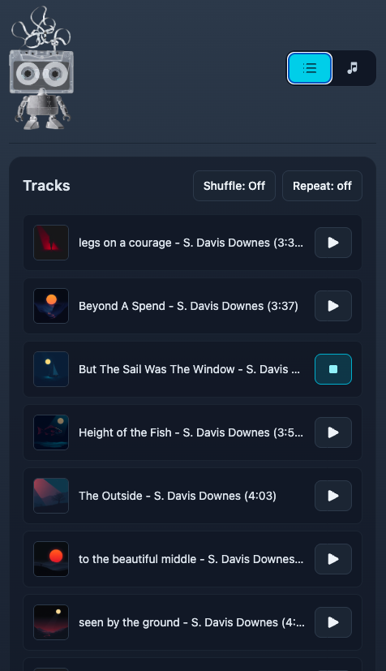
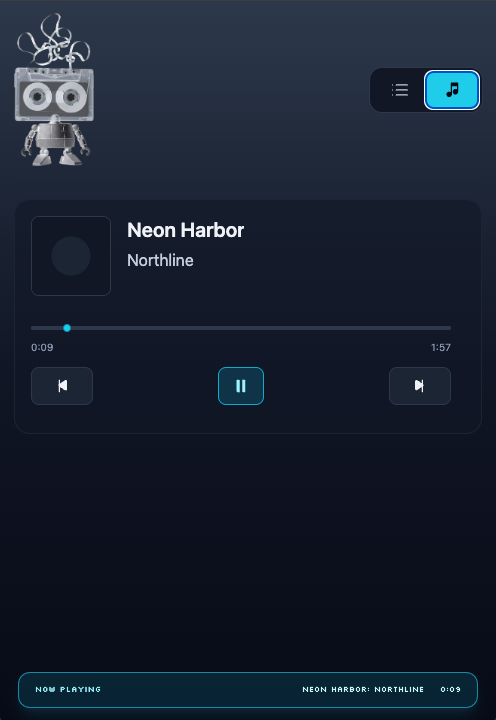
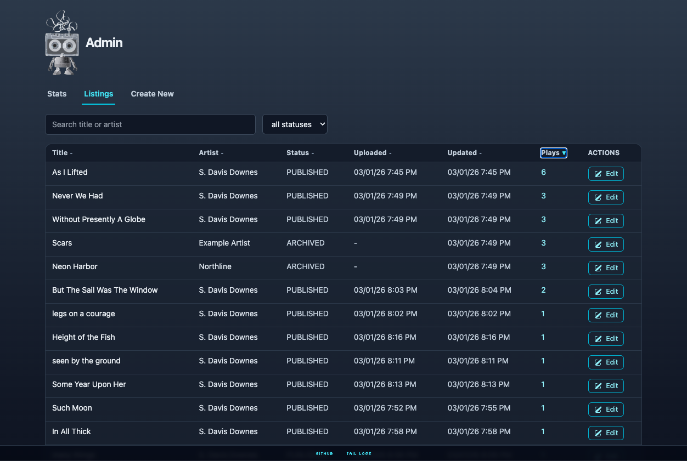
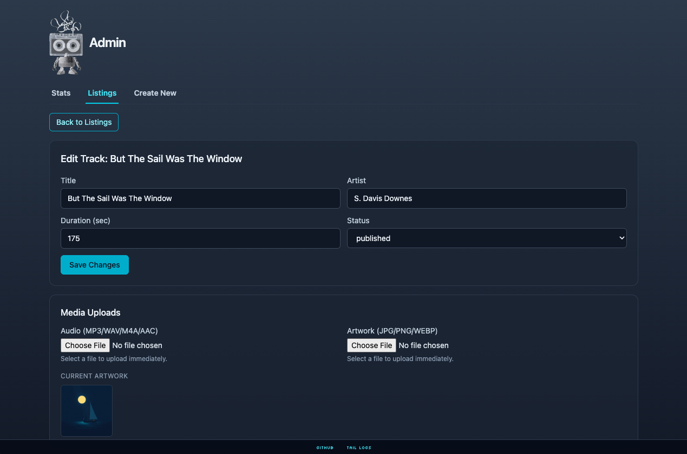

# Ferric: A Simple Streaming Music Service


## Getting Started

1. From repo root, start API + Web services (additional players coming soonish):

```bash
make run
```

For backend auto-reload during frontend/admin iteration:

```bash
make run-hot
```

2. Open:

`http://localhost:8080/public/index.html`

Notes:

- `make run` and `make run-hot` install backend Python deps from `backend/requirements.txt` before startup.
- `make run` applies Alembic migrations before backend startup.
- To use custom local ports/hosts, copy `.env.example` to `.env` and edit values there (`Makefile` auto-loads `.env`).
- Default DB is SQLite (`sqlite:///./backend/ferric.db`).
- Override with `DATABASE_URL=... make run` (SQLite/Postgres).
- Admin UI: `http://127.0.0.1:8000/admin` (HTTP Basic auth, default `admin`/`admin`).
- Tail Logs page: `http://127.0.0.1:8000/admin/logs`.
- Log files are written to `backend/logs/backend.log` and `backend/logs/frontend.log`.

<A HREF="./docs/list.png"></A>

<A HREF="./docs/track.png"></A>

<A HREF="./docs/admin_list.png"></A>

<A HREF="./docs/admin_track.png"></A>

## Core Docs

- Product requirements: [`docs/PRD.md`](docs/PRD.md)
- Execution checklist and decisions: [`docs/TODO.md`](docs/TODO.md)
- Phase 3 plan: [`docs/phase3-plan.md`](docs/phase3-plan.md)
- Demo flow: [`docs/demo-runbook.md`](docs/demo-runbook.md)
- Local startup/debug: [`docs/local-debug-runbook.md`](docs/local-debug-runbook.md)

## Development Details

For build/test commands, asset generation, and repo layout, see:

- [`docs/development.md`](docs/development.md)
